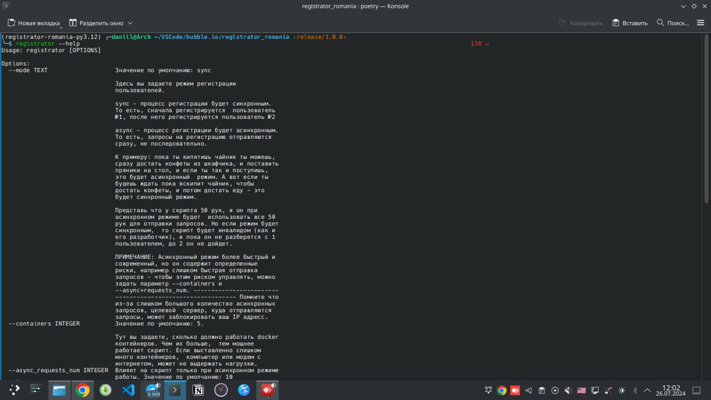

<h1 align="center">Registrator romania</h1>


## Before you run

1. Sure the docker and docker-compose installed, and docker running.

To install docker please, find any youtube video for your platform - Windows, Linux or Macos. After install run it

2. Sure the [python3.12](https://www.python.org/downloads/release/python-3120/) and [pip](https://www.python.org/downloads/release/python-3120/) (package manager) install.

After install type follow commands:

```
pip -V  # If your platform MacOs, type pip3

python -V  # If your platform MacOs, type python3
```

You should see version of python and pip, if you don't see versions, maybe you should reinstall it

3. Install `poetry` (package manager)

Docs to install poetry (same thing as pip), you found [here](https://python-poetry.org/docs/#installing-with-pipx)

to check that you success install poetry, type

```bash
poetry -V
```

you should see version of poetry.

4. You should be create and fill file `.env` by example in `.env-example` file


## How to run cli app locally

### If you don't have this app, first that you do:

1. Clone this repository

```
git clone https://github.com/devtolmachev/registrator-romania.git
```

2. Change dir to root of repo, for example:
   
```bash
cd registrator-romania
```

### If you already cloned the repo, update code:

1. open terminal in root of repo

2. Switch branch on main (it need to 1 time)

```bash
git checkout main
``` 

3. Update the code

```bash
git pull origin main
``` 

### Run app:
1. Make sure the docker running!!!!!!!!!!!!!!
2. type follow command in **ROOT OF PROJECT**!!!

```bash
poetry run python -m registrator_romania --help
```

3. You should see instruction for each parameter.




4. Pass parameters to `poetry run python -m registrator_romania <parameters>`

5. Run applications by command
   
```bash
poetry run python -m registrator_romania <parameters>
```
